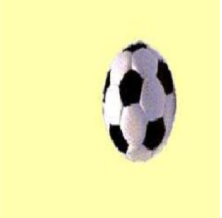
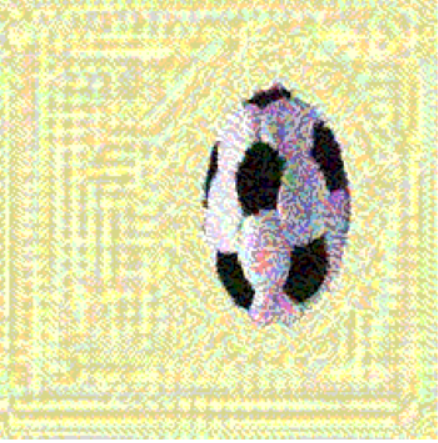
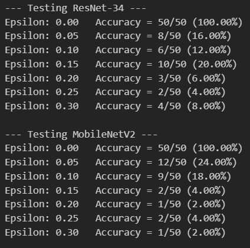
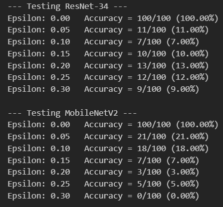

# Introduction

In this task we explored Transfer Learning, Attack methods, defense methods, and model Explainability.

# Attack Methods
The main purpose of attack methods is to alter the data in such a way that it doesn't appear altered to humans, but the model fails on that data even if it was trained on this same data.

One popular method is the attack method: `FGSM attack`.

## Core Idea
When training our model, we seek to update the weights in the direction that minimizes the loss. In FGSM attack, we update the pixel's value such that we move it in the direction that maximizes the loss!

Formula:
$$
x_{new} = x + \epsilon \cdot \text{sign}\big(\nabla_x \mathcal{L}(\theta, x, y)\big)
$$

## Code

```python
def fgsm_attack(image, epsilon, data_grad):
    # Get the direction of the gradient (either +1 or -1 for every pixel)
    sign_data_grad = data_grad.sign()
    
    # Multiply by epsilon (attack strength) and add to the original image
    # Adds "noise" to the image
    bad_image = image + epsilon * sign_data_grad
    
    return bad_image
```


## Example
Here is an example from the CalTech101 dataset:

Original Image:
<<<<<<< HEAD
![[image.png|154]]

Image after Attack:
![[image-1.png|155]]
=======


Image after Attack:

>>>>>>> 70a2c527b3894f038fc0422e0566725255f41641

## How Epsilon affects the attack strength

As you can see from the formula above, the parameter $\epsilon$ tells us how far in the opposite direction of the gradient do we want to go.
Thus, $\epsilon$ represents the strength of the attack, more $\epsilon$ more damaged data!

Here is a comparison between different epsilons and how they affect the final accuracy:
For each $\epsilon$, we choose a random subset of the data of size 50, and attack the data and check the model's accuracy.
<<<<<<< HEAD
![[image-2.png|226]]
=======

>>>>>>> 70a2c527b3894f038fc0422e0566725255f41641

As expected, when $\epsilon$ is zero, the attack doesn't actually do a thing as:
$$
x_{new} = x + 0= x
$$
Also, as expected, the more we increase $\epsilon$, the more the accuracy decreases.
But one might ask, shouldn't the accuracy strictly monotonically decrease when $\epsilon$ increases? Why is this not the case here?

The answer to this would be: Statistical Luck. When $\epsilon$ is large, it might overshoot to a place that doesn't necessarily make the model fail. But this depends on luck.

This is why we want to find a small $\epsilon$ that almost grantees bad accuracy, as a large $\epsilon$ can overshoot and give us an undesirable result.

This minimum $\epsilon$ could be between 0.1 and 0.15, as after that we can see some fluctuations start to appear.

<<<<<<< HEAD
![[image-3.png|238]]
=======

>>>>>>> 70a2c527b3894f038fc0422e0566725255f41641

# Model Explainability

Now to understand how exactly does the attack from above affect the model we use 2 model Explainability methods:
1. Gradient Saliency Map: Draws a map of gradient magnitudes of each pixel
2. Grad-Cam: Draws a map that shows where the model "focuses" its view on

<<<<<<< HEAD
## Gradient Saliency Map

### Main Idea

In Saliency Map, we basically check how much each pixel contributed to the final predicted answer. We do this by calculating the gradient of the correct class score with respect to each individual pixel.

### Code
```python
def generate_saliency_map(model, image, target_class=None):

    # Puts the model in testing mode
    model.eval()

    # Clone and detach the image to create a clean leaf tensor,
    # then explicitly require gradients for it.
    img_tensor = image.clone().detach().requires_grad_(True)

    # Forward pass
    output = model(img_tensor)

    # If no target class is specified, use the model's top prediction
    if target_class is None:
        target_class = output.argmax(dim=1).item()

    # Get the specific score for the target class
    score = output[0, target_class]

    # Clear previous gradients and run backward pass
    model.zero_grad()
    score.backward()

    # Extract the gradients of the input image
    gradients = img_tensor.grad.data.abs().squeeze()

    # Take the maximum across the 3 color channels to get a single 2D map
    saliency, _ = torch.max(gradients, dim=0)

    # Normalize the map between 0 and 1 for clean visualization
    saliency = (saliency - saliency.min()) / (saliency.max() - saliency.min())

    return saliency.cpu().numpy()
```
### Example

This is an example of a clean non-attacked image, and as you can see, the map nearly highlights the ball's pixels:
![[image-4.png|482]]


Now, this is an example of an attacked image:

![[image-5.png|482]]

As you can see, the attacked image's maps highlights many pixels that are far from the ball, which shows that the corrupted pixels greatly affected the final output of the model.
## Grad-Cam

### Main Idea

It's a method that highlights which parts of the image strongly influenced the final output.

### Code

```python
import torch.nn.functional as F
from matplotlib import colormaps

class GradCAM:
    def __init__(self, model, target_layer):
        """
        Attaches hooks to the target layer to intercept activations and gradients.
        """
        self.model = model
        self.target_layer = target_layer
        self.gradients = None
        self.activations = None

        # Register hooks to intercept the data flowing through the target layer
        self.target_layer.register_forward_hook(self.save_activation)
        self.target_layer.register_full_backward_hook(self.save_gradient)

    def save_activation(self, module, input, output):
        self.activations = output.detach()

    def save_gradient(self, module, grad_input, grad_output):
        self.gradients = grad_output[0].detach()

    def generate_cam(self, input_image, target_class=None):
        """
        Generates the Grad-CAM heatmap for a given image and target class.
        """
        self.model.eval()
        input_image = input_image.clone().detach().requires_grad_(True)
        
        # Forward pass
        output = self.model(input_image)
        
        if target_class is None:
            target_class = output.argmax(dim=1).item()
            
        # Backward pass
        self.model.zero_grad()
        score = output[0, target_class]
        score.backward()
        
        # Get the gradients and activations we captured
        gradients = self.gradients
        activations = self.activations
        
        # Global Average Pooling on the gradients to get the "weights"
        # We average across the spatial dimensions (height and width)
        weights = torch.mean(gradients, dim=[2, 3], keepdim=True)
        
        # Multiply the feature map (activations) by the importance weights
        cam = torch.sum(weights * activations, dim=1, keepdim=True)
        
        # Apply ReLU to only keep features that have a positive influence
        cam = F.relu(cam)
        
        # Resize the small feature map back to the original image size (224x224)
        cam = F.interpolate(cam, size=input_image.shape[2:], mode='bilinear', align_corners=False)
        
        # Normalize the map between 0 and 1
        cam = cam.squeeze()
        cam = (cam - cam.min()) / (cam.max() - cam.min() + 1e-8)
        
        return cam.cpu().numpy()
```

### Example

As you can see, the heatmap correctly highlights the ball and barely anything else.

![[image-6.png|521]]


Here the attack method succeeded in that the model focuses on a spot other than the ball

![[image-7.png|523]]
# Defense Methods
The main purpose of defense methods is to harden our models and make them resilient to the adversarial attacks we generated earlier.
We chose to implement the most direct defense strategy: Adversarial Training.

## Main Idea
To protect the model against attacks, we train the model with the dataset and with an attacked version of the dataset! This way it learns to recognize the object, whether its clean or has noise/attacked.

## Code
```python
def adversarial_train_epoch(model, device, train_loader, optimizer, epsilon):
    model.train()
    total_loss = 0
    correct = 0
    total = 0

    for batch_idx, (data, target) in enumerate(train_loader):
        data, target = data.to(device), target.to(device)
        
        # Generate Adversarial Examples
        # We need gradients for the input data to create the attack
        data.requires_grad = True
        
        # Forward pass on clean data
        output_clean = model(data)
        loss_clean = F.cross_entropy(output_clean, target)
        
        # Calculate gradients for FGSM
        model.zero_grad()
        loss_clean.backward(retain_graph=True) 
        data_grad = data.grad.data
        
        # Apply FGSM to create the attacked batch
        adv_data = fgsm_attack(data, epsilon, data_grad)
        
        # Train on Both Clean and Attacked Images
        optimizer.zero_grad()
        
        # We already have the output for clean data, now get output for adv data
        output_adv = model(adv_data)
        loss_adv = F.cross_entropy(output_adv, target)
        
        # Combine the losses: teach it to be accurate on both!
        combined_loss = 0.5 * loss_clean + 0.5 * loss_adv
        
        # Backward pass & optimize
        combined_loss.backward()
        optimizer.step()

        # Track metrics (we'll track accuracy on the adversarial examples)
        total_loss += combined_loss.item()
        pred_adv = output_adv.argmax(dim=1, keepdim=True)
        correct += pred_adv.eq(target.view_as(pred_adv)).sum().item()
        total += target.size(0)

        if batch_idx % 20 == 0:
            print(f"Batch {batch_idx}/{len(train_loader)} | Combined Loss: {combined_loss.item():.4f} | Adv Batch Accuracy: {100. * correct / total:.2f}%")
            
    return model
```

## Example (Showdown)
To quantitatively prove the effectiveness of this defense, we evaluated both the original model and the safer model against a clean test set and an adversarially attacked test set ($\epsilon = 0.15$).

The results:

![[image-8.png|493]]

Both models performed really good on the clean dataset, but on the attacked dataset only the "hardened" model performed good because it was trained with the attacked dataset.


## Example (Image)

In the below image, we can see that the model originally focused on the 2 circles, the one on the top and the one on the bottom.

When the image was attacked, the original model's focus got scattered and it made a wrong prediction.

Then when the model was hardened, it started focusing again on the 2 circles and made a correct prediction!

![[image-9.png|407]]
=======
# Defense Methods
>>>>>>> 70a2c527b3894f038fc0422e0566725255f41641
